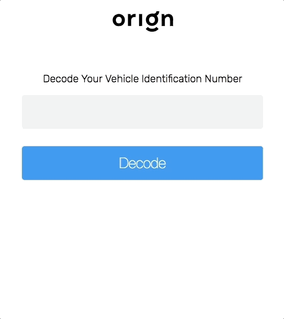

# [Origin](http://useorigin.com) Front-End Take-Home Assignment

## Additional Features

### Live Environment

[](https://app.netlify.com/sites/origin-assignment-broken/deploys)

Link: https://origin-assignment-broken.netlify.com/

### CI

[](https://circleci.com/gh/mariobrusarosco/origin/tree/master)

----
### End to End updated structure

> When running E2E tests, `npm run test:e2e` will serve the Application and run the tests. No need to call `npm run start` before!!

---
### HTML 5 Validation Option

> `VinInput` component can receive a prop named `html5Validation`. It's a `boolean` and when passed with `true` makes the `input` element be rendered:

* as a required input
* with a regex to make sure 17 chars were passed

---
### Error Handling

> The project has a file named `errorMap` inside `src/config` which holds all error messages that our app may need. We define a message creating an entry for this Object, using a code, e.g `A01` as the **key** and any string as the **message**. So now, we can use it anywhere in the application through a constant like `applicationErros['A01']`


**errorMap.ts**
```javascript
export default {
    A01: "Ops! Something went wrong. Try again please",
    A02: "The given VIN number is not a valid one! Please check if all characters were correctly passed"
} as any

```
**any_file.ts**

```javascript
dispatch(actions.checkVinFail(errorsMap["A01"]))
```
---
### API Error
> When a call to the API fails, the user will see a generic message, saying something went wrong
---
### Invalid VIN
> When an invalid VIN is passed, the user will see a more specific error. The used API brings back a more detailed error, based on the position of an invalid character. But, we still can get information about the vehicle if a few other characters were correctly typed. Another approach would be to show the partial returned vehicle data and inform the user to check the typed VIN again.


---
---
---


This application used to allow users to type a car's [VIN number](https://www.autocheck.com/vehiclehistory/autocheck/en/vinbasics) and see it's `year of production`, `make`, `model` and `trim`.

Important parts of it **were intentionally deleted**. We want you to rewrite the deleted parts so that this application works again and it's tests pass.

### Additional behaviour for retrieving the VIN information: User can press ENTER right after typing its VIN code!

## What needs to be done?

### VIN API Integration

The first task is to fix the [VIN Service](src/services/vinService.ts). Some functions in that file were removed, but we kept its type signatures to make it easier for you.

It's a simple TDD problem: find a VIN API you like, build an integration with it, run the [unit tests for that service](src/services/vinService.spec.ts) and make the failing ones green again. Naturally, hardcoded functions with test data won't be accepted.

The `response converter` test suit is `skipped` since we allow you to integrate with any VIN API you like. That means you don't have to adjust your integration to match the skipped tests, but you **must** write your own tests for the integration you build. It is the only test suite that you are required to write: we care about testing and want to be sure that you know how to write them.

### Component styling

The styling for the [react components](src/components) were also removed, so that we can test your ability to write it again just from these [committed screenshots](screenshots).

We are aware that styling is not what makes you a great programmer, so you don't have to show advanced CSS tricks: just make sure the images [Cypress](https://www.cypress.io/) automatically generated when you run the end to end tests (in `/cypress/screenshots/App.spec.ts/`) are similar enough to the originals.



### Redux-loop integration

We love functional programming, but relax: we won't force you to write any Monads here.

Though this project uses [`redux-loop`](https://github.com/redux-loop/redux-loop), the command integration from our [reducer](src/store/index.ts) was removed. Your last task is to fix that command usage and the `checkVinCmd` implementation.

## How do I test it?

Use the `npm run test:unit` and `npm run test:e2e` to run all the application's tests and check what parts of the application are broken.

OBS: to run the end to end tests you need the application to be started before. And don't forget to install the dependencies first!
